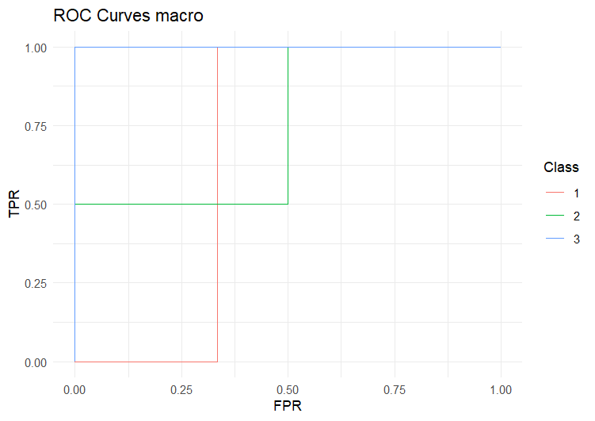
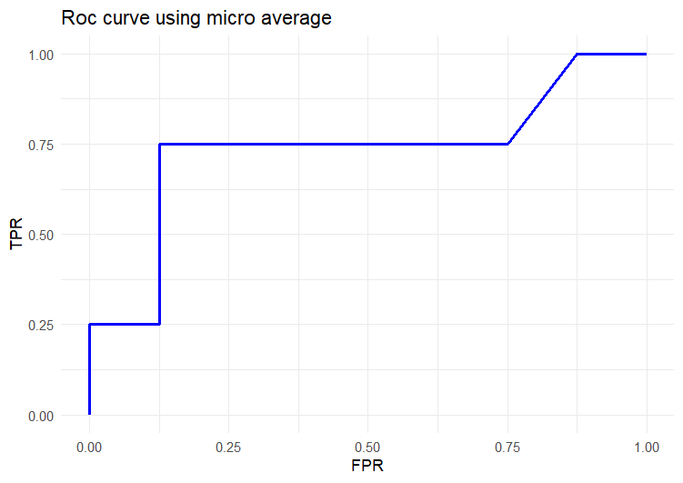

# torchMAUM
This R package provides a torch efficient extension of the AUM for multi-class classification, which was created to  be used as a surrogate loss for optimizing Area Under the ROC Curve (AUC) in supervised binary classification and changepoint detection problems.
# Installation
```r
if(!requireNamespace("remotes"))install.packages("remotes")
  remotes::install_github("tdhock/aum")
```
# Usage 
To extend AUM for multi-class classification , the OvR(One-Versus-Rest) approach was used , to average results , both macro and micro averages were used and there is one funtion for each averaging method( see [Scikit-learn](https://scikit-learn.org/stable/auto_examples/model_selection/plot_roc.html#) for more details and equations)
Given a  labels tensor:
```r
four_labels = torch::torch_tensor(c(1,3,2,2),dtype=torch::torch_long())
```
and a prediction tensor:
```r
four_pred = torch::torch_tensor(matrix(c(0.4, 0.3, 0.3,
                          0.2, 0.1, 0.7,
                          0.5,0.2,0.3,
                          0.3,0.4,0.3),
                          ncol=3,byrow=TRUE))
```
We could :
- Plot ROC curves using either macro or micro averaging
- Compute AUC either macro or micro
- Compute the AUM either macro or micro, micro AUM supports weighting .
### ROC curves
ROC macro:
```r
(torchMAUM::Draw_ROC_curve_macro(four_pred,four_labels))
```


ROC micro:
```r
(torchMAUM::Draw_ROC_curve_micro(four_pred,four_labels))
```

### AUC value
AUC macro:
```r
(torchMAUM::ROC_AUC_macro(four_pred,four_labels))
```
```r
torch_tensor
0.805556
[ CPUFloatType{} ]
```
AUC micro:
```r
(torchMAUM::ROC_AUC_micro(four_pred,four_labels))
```
```r
torch_tensor
0.734375
[ CPUFloatType{} ]
```
### AUM values
AUM macro:
```r
(torchMAUM::ROC_AUM_macro(four_pred,four_labels))
```
```r
torch_tensor
0.0277778
[ CPUFloatType{} ]
```
AUM micro:
The AUM micro has two variants: either weighted or unweighted . To use the weighted version we need to pass the counts of each class in the dataset to the function :
unweighted:
```r
(torchMAUM::ROC_AUM_micro(four_pred,four_labels,counts=NULL))
```
```r
torch_tensor
0.05
[ CPUFloatType{} ]
```
weighted:
```r
counts=torch::torch_tensor(c(1,2,1))
(torchMAUM::ROC_AUM_micro(four_pred,four_labels,counts=counts))
```
